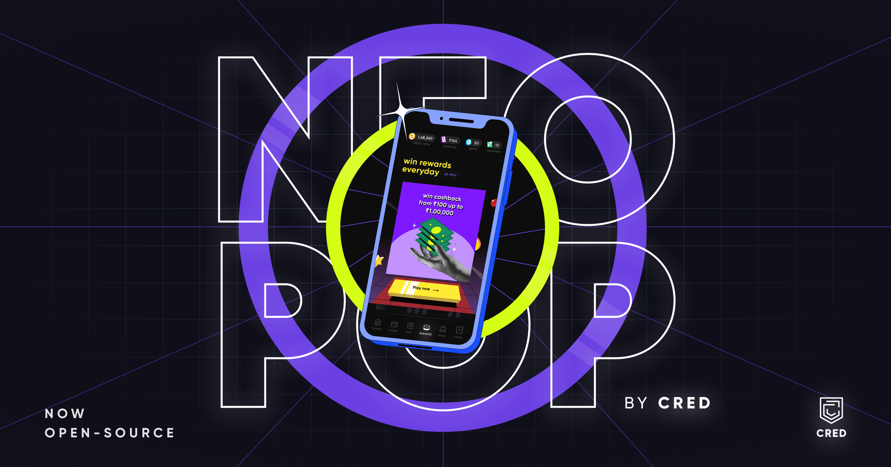

<div align="center">
    
    <h1>NeoPOP</h1>
    <strong>NeoPOP is CRED's inbuilt library for using NeoPOP components in your web app.</strong>
</div>
<br>
<div align="center">
    <a href="https://github.com/CRED-CLUB/neopop-web/blob/main/LICENSE">
        
    </a>
    <a href="https://twitter.com/cred_club">
        
    </a>
</div>
<div align="center">
    <br>
    <a href="https://playground.cred.club"><b>Playground/Docs »</b></a>
    <br><br>
</div>

## what is NeoPOP?

NeoPOP was created with one simple goal, to create the next generation of the next beautiful, more affirmative, design system. NeoPOP stays true to everything that design at CRED stands for.

## what this library features?

-   Easy to use and beautifully designed React components based on NeoPOP design system.
-   Flexible and composable components which accepts custom configurations.
-   Commonly used utility methods and functions.
-   Fluid and highly optimized animations.

> note: currently the components in this library are optimized for mobile views, we will soon release support for desktop views.

## how to install?

to use NeoPOP library, all you need to do is install the `@cred/neopop-web` package and its peer dependencies:

```sh
yarn add @cred/neopop-web react react-dom styled-components

# or

npm i @cred/neopop-web react react-dom styled-components
```

## how to use?

to start using the library you can,

-   import components from `@cred/neopop-web/lib/components`
-   import primitives from `@cred/neopop-web/lib/primitives`
-   import hooks from `@cred/neopop-web/lib/hooks`
-   import utils from `@cred/neopop-web/lib/utils`

for example, to use button refer the following code snippet:

```jsx
import { Button } from '@cred/neopop-web/lib/components';

const Page = () => {
    return (
        <Button
            variant="primary"
            kind="elevated"
            size="big"
            colorMode="dark"
            onClick={() => {
                console.log("I'm clicked");
            }}
        >
            Primary
        </Button>
    );
};

export default Page;
```

a detailed documentation and an interactive playground can be found [here](https://playground.cred.club)

## contributing

pull requests are welcome! we'd love help improving this library. feel free to browse through open issues to look for things that need work. if you have a feature request or bug, please open a new issue so we can track it.

## contributors

-   Chirag Mittal — [Github](https://github.com/mittalchirag) | [Linkedin](https://www.linkedin.com/in/mittalchirag/)
-   Tripurari Shankar — [Github](https://github.com/tripurari001) | [Linkedin](https://www.linkedin.com/in/tripurari-shankar-91907189/)
-   Rahul Jain — [Github](https://github.com/rahuldkjain) | [Linkedin](https://www.linkedin.com/in/rahuldkjain/)
-   Utkarsh Gupta — [Github](https://github.com/Utkarsh9799) | [Linkedin](https://www.linkedin.com/in/utkarsh-gupta-99923916a/)
-   Aditya Sharma — [Github](https://github.com/sharmaaditya570191) | [Linkedin](https://www.linkedin.com/in/sharmaaditya570191/)
-   Abhishek Naidu — [Github](https://github.com/abhisheknaiidu) | [Linkedin](https://www.linkedin.com/in/abhisheknaiidu/)

## license

```
Copyright 2022 Dreamplug Technologies Private Limited.

Licensed under the Apache License, Version 2.0 (the "License");
you may not use this file except in compliance with the License.
You may obtain a copy of the License at

 http://www.apache.org/licenses/LICENSE-2.0
Unless required by applicable law or agreed to in writing, software
distributed under the License is distributed on an "AS IS" BASIS,
WITHOUT WARRANTIES OR CONDITIONS OF ANY KIND, either express or implied.
See the License for the specific language governing permissions and
limitations under the License.
```
